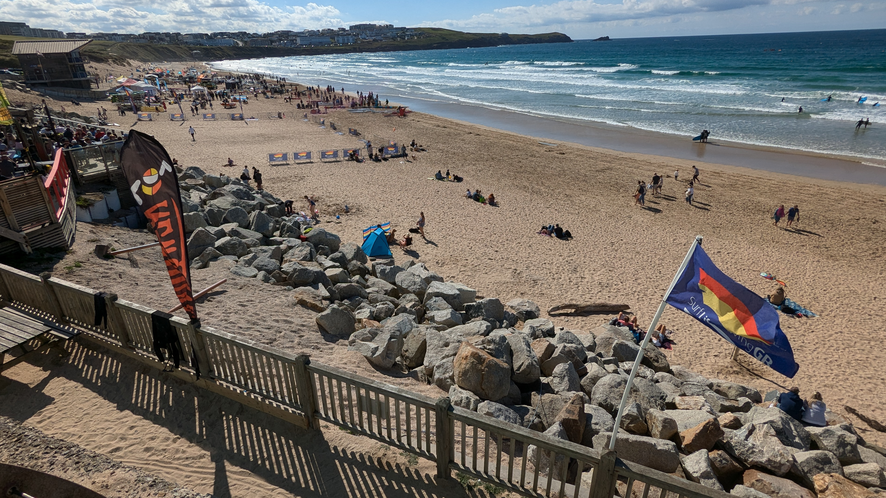


  
  
  
  


## Our Mission

To promote water safety, develop beach life saving techniques and to encourage active participation in SLS competitions and SLSGB awards.

To provide facilities for exercise to all members regardless of their ability and to provide equality of opportunity within all aspects of club life.

## Latest News

### Summer Training Schedule Released
*March 10, 2025*

Our summer training schedule is now available! Sessions will begin on April 15th and run through September. All members are encouraged to participate.

### New Equipment Arrives
*March 5, 2025*

We're excited to announce the arrival of our new rescue boards and tubes. These will be available for training starting next week.

## Join Us

Whether you're an experienced lifesaver or completely new to the sport, we welcome members of all abilities. Check out our [membership page](/membership/) for more information.

## Upcoming Events

- **Beach Clean** - March 20, 2025
- **Season Opening Competition** - April 8, 2025
- **Junior Training Camp** - May 15-17, 2025

[View all events →](/events/)
