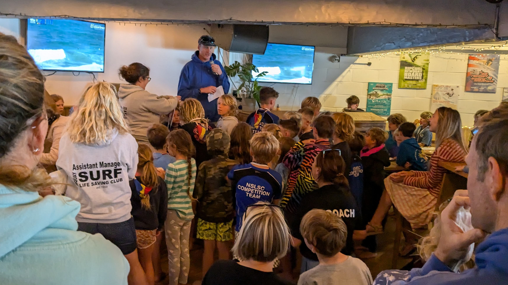


  This page contains example content and should not be taken literally


## Our History

Established in 1958, Newquay Surf Life Saving Club has been a cornerstone of beach safety in Cornwall for nearly 70 years. What began as a small group of dedicated volunteers has grown into one of the UK's premier surf lifesaving clubs.

## Our Mission

To promote water safety, develop beach life saving techniques and to encourage active participation in SLS competitions and SLSGB awards.

To provide facilities for exercise to all members regardless of their ability and to provide equality of opportunity within all aspects of club life.

## Our Committee

| Position | Name | Contact |
|----------|------|---------|
| Chairperson | Jane Smith | chair@nslsc.org.uk |
| Secretary | John Brown | secretary@nslsc.org.uk |
| Treasurer | Sarah Williams | treasurer@nslsc.org.uk |
| Head Coach | Mike Johnson | coach@nslsc.org.uk |
| Junior Coordinator | Lisa Davies | juniors@nslsc.org.uk |

## Our Facilities

Our clubhouse is located on Fistral Beach and includes:

- Changing rooms and showers
- Equipment storage
- Training room
- Social area
- First aid station

## Affiliations

We are proud members of:

- Surf Life Saving Great Britain (SLSGB)
- Royal Life Saving Society UK (RLSS UK)
- International Life Saving Federation (ILS)
