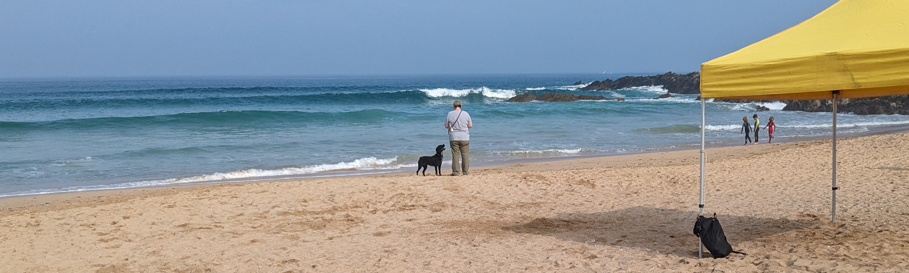


  This page contains example content and should not be taken literally


## Feedback

We value your feedback. If you have any suggestions, comments, or concerns, please email feedback@nslsc.org.uk or use the form below:

<iframe width="640px" height="480px" src="https://forms.office.com/Pages/ResponsePage.aspx?id=nH2y_waR20KHQGlZePwZ1u2Y6FocNtlHlkwrVG5qEJRURTdUS0pYSVJPWDlDOUtBWDgzVFFKOEtEVS4u&embed=true" frameborder="0" marginwidth="0" marginheight="0" style="border: none; max-width:100%; max-height:100vh" allowfullscreen webkitallowfullscreen mozallowfullscreen msallowfullscreen> </iframe>

## Specific Enquiries

Please use the relevant form:

 - [Nippers contact form](/contact/nippers)
 - [Seniors contact form](/contact/seniors)

## General Enquiries

**Email:** info@nslsc.org.uk  
**Phone:** 01637 123456

## Key Contacts

| Position | Name | Contact |
|----------|------|---------|
| Chairperson | Jane Smith | chair@nslsc.org.uk |
| Secretary | John Brown | secretary@nslsc.org.uk |
| Treasurer | Sarah Williams | treasurer@nslsc.org.uk |
| Membership Secretary | David Jones | membership@nslsc.org.uk |
| Head Coach | Mike Johnson | coach@nslsc.org.uk |
| Junior Coordinator | Lisa Davies | juniors@nslsc.org.uk |
| Events Coordinator | Tom Wilson | events@nslsc.org.uk |

## Location

**Clubhouse Address:**  
Newquay Surf Life Saving Club  
Fistral Beach  
Headland Road  
Newquay  
Cornwall  
TR7 1HY

## Map

<iframe src="https://www.google.com/maps/embed?pb=!1m18!1m12!1m3!1d2551.1544111409747!2d-5.1031937!3d50.4178061!2m3!1f0!2f0!3f0!3m2!1i1024!2i768!4f13.1!3m3!1m2!1s0x486b25563a3b2b8d%3A0x6e6936f8c8cd7f85!2sFistral%20Beach!5e0!3m2!1sen!2suk!4v1615554407015!5m2!1sen!2suk" width="600" height="450" style="border:0;" allowfullscreen="" loading="lazy"></iframe>

## Social Media

Follow us on social media to stay updated with club news and events:

- [Facebook](https://www.facebook.com/newquaysurflifesavingclub)
- [X (formally Twitter)](https://x.com/newquayslsc)

## Emergency Information

For beach emergencies, call 999 and ask for the Coastguard.

Check the [RNLI website](https://rnli.org/find-my-nearest/lifeguarded-beaches/fistral-beach) to find out when the lifeguard service operates at Fistral Beach.
