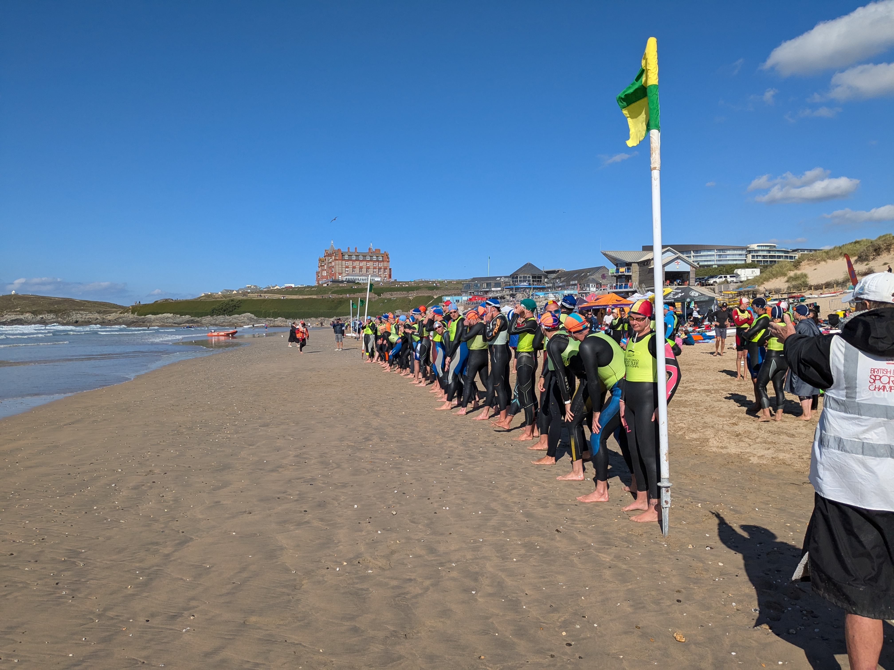


    
    


---


  This page contains example content and should not be taken literally


## Upcoming Events

### March 2025

#### Beach Clean
*March 20, 2025 | 10:00-12:00 | Fistral Beach*

Join us for our monthly beach clean. Equipment provided. All ages welcome.

#### Committee Meeting
*March 25, 2025 | 19:00-21:00 | Clubhouse*

Monthly committee meeting. Members welcome to attend.

### April 2025

#### Season Opening Competition
*April 8, 2025 | 09:00-16:00 | Fistral Beach*

Our first competition of the season. Categories for all age groups. Registration required.

#### Easter Social
*April 12, 2025 | 18:00-22:00 | Clubhouse*

Family-friendly social event with BBQ and games. £5 per person.

#### Lifeguard Qualification Course
*April 15-18, 2025 | 09:00-17:00 | Clubhouse & Beach*

Four-day intensive course for the Surf Lifeguard Award. Pre-registration essential.

### May 2025

#### Junior Training Camp
*May 15-17, 2025 | Various times | Fistral Beach*

Three-day training camp for junior members. Focusing on skills development and team building.

#### Cornwall Surf Lifesaving Championships
*May 24-25, 2025 | 08:00-18:00 | Perranporth Beach*

County championships. Club will arrange transport for competitors.

## Competition Calendar

Our club participates in a variety of competitions throughout the year, catering to all age groups and abilities:

### Nipper Competitions (Under 14s)
- Max Hocking Fun Day
- Cornish Nipper Surf Championships
- National Nipper Surf Championships
- Cornish & National Nipper Frostbite (Stillwater)

### Youth Competitions (14-18 years)
- Cornish Youth Surf Championships
- National Youth Surf Championships
- Cornish & National Youth Frostbite (Stillwater) – Winter

### Senior & Masters Competitions
- Cornish Senior Surf Championships
- National Senior Surf Championships
- National Masters Surf Championships

*Dates and locations for this season's competitions will be announced soon. Please check our Club Membership Cloud portal for the most up-to-date information.*

## Social Events

- **Monthly Social Nights** - First Friday of each month at the clubhouse
- **Annual Awards Dinner** - October 15, 2025 at Newquay Atlantic Hotel
- **Christmas Party** - December 12, 2025 at the clubhouse

## Volunteering Opportunities

We rely on volunteers to run our events. If you can help with any of the following, please contact events@nslsc.org.uk:

- Event setup and breakdown
- Water safety
- Judging and officiating
- First aid cover
- Catering
- Photography

[Download 2025 Events Calendar (PDF)](#) (Coming soon)
