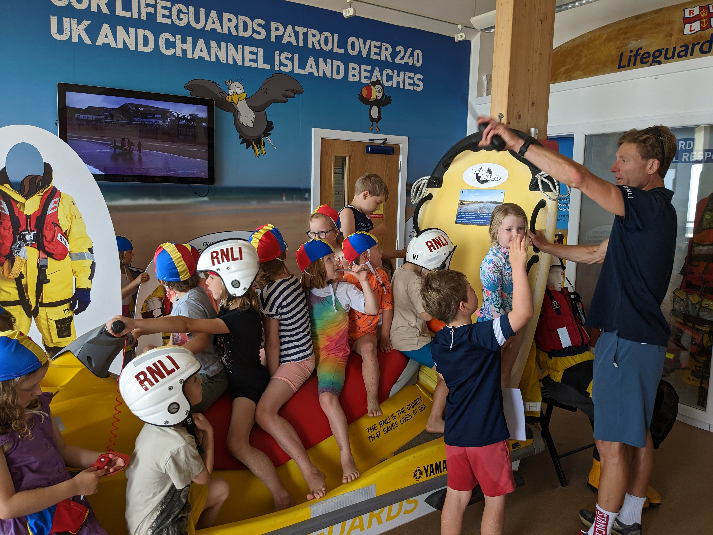
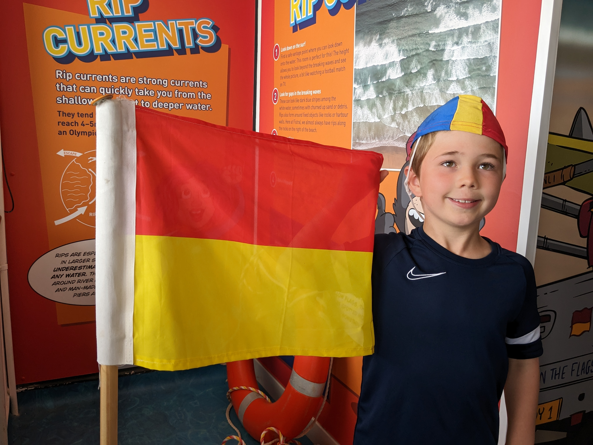


    
    


## Discover the world of RNLI Lifeguards at the UK's only lifeguard visitor centre

The visitor centre is free and family friendly and a great way to start off your visit to Fistral beach in Newquay.

The visitor centre is on the first floor of the RNLI Lifeguard building and access is up steps with no lift available. Opening times may vary depending on volunteer availability.

### Address

RNLI Lifeguard Station

Fistral Beach,
Newquay, 
Cornwall, 
TR7 1HY

### Opening times

Monday - Saturday

11am to 3pm

Opening times may vary due to volunteer availability.

### Admission - Free

There is no cost of admission to visit the Fistral Lifeguard Visitor Centre.

---

