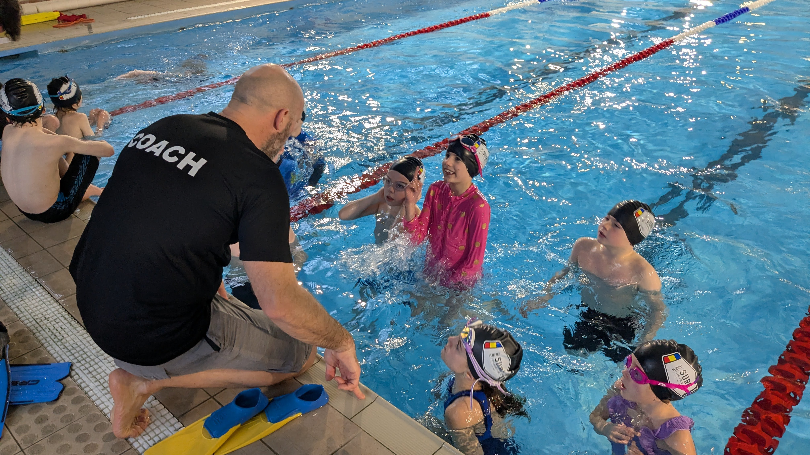


  This page contains example content and should not be taken literally


## About Our Club

Newquay Surf Life Saving Club is based at Fistral Beach in Newquay. We offer training and activities for various age groups, focusing on water safety, lifesaving skills, and community engagement.

## Membership Categories

We have several sections to accommodate different age groups:

### Sandhoppers (age 5+)
- No trial required
- Training takes place on Sundays
- Spaces available based on capacity

### Nippers (age 7-12)
- Must be able to swim a minimum of 50m
- Training takes place on Sundays
- Trials held in October
- Must pass swimming assessment

### Youth (age 12-18)
- Must be competent swimmers
- Training takes place on Monday evenings
- Assessment required

### Seniors (age 18+)
- Training takes place on Tuesdays
- For experienced swimmers and lifesavers

## How to Join

### For Nippers and Youth
If you're interested in joining our Nippers or Youth sections:
1. Provide your details using the contact form below
2. You'll be added to our waiting list
3. Our waiting list manager will contact you about trial dates (held in October)
4. Attend the trial session

### For Sandhoppers
1. Submit your interest using the contact form
2. No trial is required
3. We'll contact you when spaces become available

### For Seniors
Please contact seniors@nslsc.co.uk directly for information about joining our senior section.

## Contact Information

For general membership inquiries: enquiries@nslsc.co.uk

For senior membership inquiries: seniors@nslsc.co.uk
