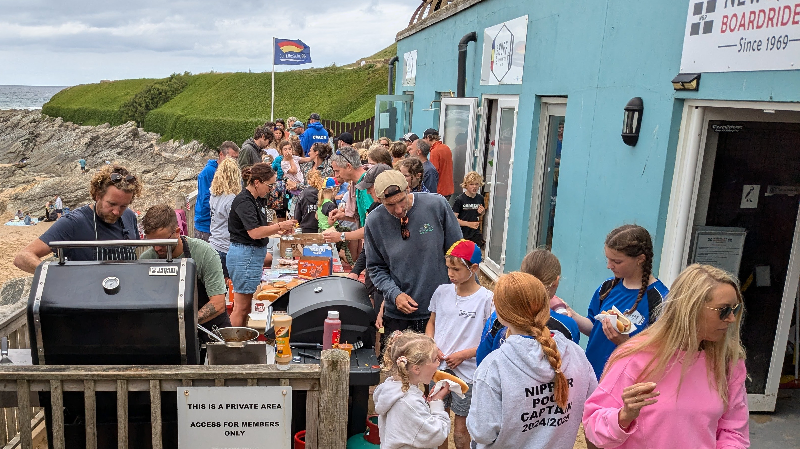

## About Our Club

Newquay Surf Life Saving Club is based at Fistral Beach in Newquay. We offer training and activities for various age groups, focusing on water safety, lifesaving skills, and community engagement.

During the summer training is on a Sunday morning at Fistral or another Newquay beach. In the winter training is pool based and we have to fall in line with pool availability.

Fees are set at an AGM each year.

## Membership Categories

We have several sections to accommodate different age groups:

### Sandhoppers (age 5+)
- No trial required
- Training takes place on Sundays
- Spaces available based on capacity
- [Find out more information](/membership/sandhoppers)

### Nippers (age 7-12)
- Must be able to swim a minimum of 50m with a good stroke if aged 7-9
- Must be able to swim a minimum of 100m with a good stroke if aged 10-12
- Training takes place on Sundays
- Trials held in October
- Must pass swimming assessment
- [Find out more information](/membership/nippers)

### Youth (age 12-18)
- Must be competent swimmers
- Training takes place on Monday evenings
- Assessment required
- [Find out more information](/membership/youth)

### Seniors (age 18+)
- Training takes place on Tuesdays
- Mixed training sessions for both experienced swimmers and lifesavers as well as beginners
- [Find out more information](/membership/seniors)

## How to Join


    
    


### For Nippers and Youth
If you're interested in joining our Nippers or Youth sections:
1. Provide your details using the contact form ([link above](#how-to-join))
2. You'll be added to our waiting list
3. Our waiting list manager will contact you about trial dates (held in October)
4. Attend the trial session

### For Sandhoppers
1. Submit your interest using the contact form ([link above](#how-to-join))
2. No trial is required
3. We'll contact you when spaces become available

### For Seniors
Please contact us using the form ([link above](#how-to-join)).

## Contact Information

See our [contact page](/contact) for help to get in touch.
