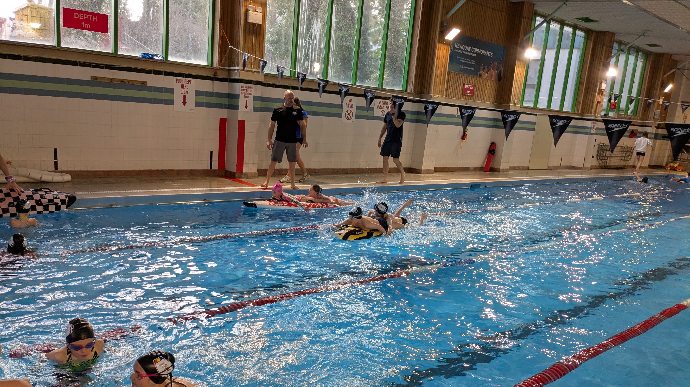

+++
title = "Training"
description = "Training programs, schedules, and qualifications at Newquay Surf Life Saving Club"
date = 2025-03-11T12:00:00Z
draft = false
+++


  This page contains example content and should not be taken literally


## Training Schedule

### Summer Season (April - September)

| Day | Time | Group | Location |
|-----|------|-------|----------|
| Monday | 18:00-19:30 | Juniors (8-13) | Fistral Beach |
| Tuesday | 18:00-19:30 | Youth (14-18) | Fistral Beach |
| Wednesday | 19:00-20:30 | Seniors | Fistral Beach |
| Thursday | 18:00-19:00 | Pool Training (All) | Newquay Leisure Centre |
| Saturday | 10:00-12:00 | All Groups | Fistral Beach |

### Winter Season (October - March)

| Day | Time | Group | Location |
|-----|------|-------|----------|
| Tuesday | 19:00-20:30 | Youth & Seniors | Newquay Leisure Centre |
| Thursday | 19:00-20:00 | Pool Training (All) | Newquay Leisure Centre |
| Sunday | 10:00-11:30 | Beach Fitness (All) | Fistral Beach |

## Training Disciplines

Our training covers all aspects of surf lifesaving:

### Water Disciplines
- Board paddling
- Surf swimming
- Rescue techniques
- Tube rescues
- Ski paddling (seniors)

### Beach Disciplines
- Beach sprints and flags
- Beach relays
- First aid
- Patrol skills

## Qualifications

We offer training for the following qualifications:

### Junior Awards
- Rookie Lifeguard Awards
- Junior Surf Competence

### Youth & Senior Awards
- Surf Lifeguard Award
- Advanced Surf Lifeguard
- First Aid Certificates
- Beach Lifeguard Qualification
- Coaching and Instructing Awards

## Equipment

The club provides training equipment including:
- Nipper boards
- Rescue boards
- Rescue tubes
- Racing skis
- Training mannequins

Members are expected to provide their own:
- Wetsuit
- Swimming costume
- Club cap (provided with membership)
- Goggles

## Coaching Team

Our qualified coaching team includes:
- Mike Johnson - Head Coach
- Sarah Williams - Junior Coach
- David Thomas - Competition Coach
- Lisa Davies - Youth Development

For any training queries, please contact our Head Coach at coach@nslsc.org.uk
